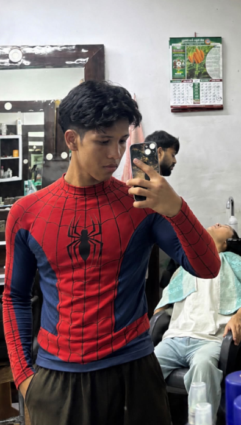

# Aayush Bhatta (`@aayushifty`)

  

  <b>High School Senior &bull; Systems &amp; Local AI Developer &bull; National Competitor &amp; Athlete &bull; Musician</b> 
  Kathmandu, Nepal &bull; <a href="https://aayushbhatta230-ux.github.io/aayushbhatta230-ux/">Live 3D Portfolio</a> &bull; <a href="mailto:aayushbhatta230@gmail.com">aayushbhatta230@gmail.com</a>

  
  
  

---

## Executive Summary

I am a Grade 12 student in Kathmandu, Nepal, specializing in Physics, Mathematics, Chemistry, and Computer Science. My technical pursuits focus on building practical, offline-first systems: local LLM automation agents on Windows, touchless computer vision instruments, and sensor-driven telematics prototypes on ESP32 microcontrollers.

Beyond engineering, I am a national competitive athlete (basketball and endurance trail conditioning), a performing musician (vocalist, acoustic and electric guitarist, dancer), and an experienced public speaker with 13 Model United Nations conferences and national debate championship selection.

---

## Technical Disciplines & Core Stack

| Domain | Technologies & Frameworks | Focus Areas |
|:---|:---|:---|
| **Local AI & Systems** | Python, Ollama, Llama 3.2, FastAPI, PyAutoGUI | Local LLM inference, OS screen & voice automation, zero-cloud security |
| **Computer Vision** | Google MediaPipe, OpenCV, Web Audio API | Real-time landmark tracking, gesture recognition, in-browser synthesis |
| **Embedded IoT** | ESP32, MPU-6050 Accelerometer/Gyroscope, GPS, C++ | Agricultural telematics, transit vibration monitoring, sensor telemetry |
| **Web Engineering** | JavaScript (ES6+), React, Vite, Three.js, CSS3 3D Transforms | High-performance 3D spatial user interfaces, WebGL particle systems |

---

## Featured Engineering Projects

### 1. [JARVIS AI Assistant](https://github.com/aayushbhatta230-ux/jarvis-ai-agent)
- **Architecture:** Local voice and multimodal assistant powered by Ollama (`llama3.2:latest`) with FastAPI backend and Web Speech / audio wave visualization.
- **Key Capabilities:** Native Windows application control, Spotify playback automation, screen mirroring, and Cloudflare tunnel bridging for secure phone control.
- **Stack:** `Python`, `Ollama`, `FastAPI`, `Web Speech API`, `Cloudflare Tunnels`

### 2. [HandChord](https://github.com/aayushbhatta230-ux/handchord)
- **Architecture:** Contactless in-air musical instrument translating webcam video into polyphonic audio synthesis in real-time.
- **Key Capabilities:** Tracks 21 distinct hand landmarks with sub-30ms latency, mapping finger coordinates to dynamic chords and arpeggios via the browser's native Web Audio engine.
- **Stack:** `JavaScript`, `Google MediaPipe`, `Web Audio API`, `Vite`

### 3. [KrishiTrust / KrishiPath](https://github.com/aayushbhatta230-ux/KrishiPath)
- **Architecture:** Vehicle-mounted telematics prototype monitoring produce transport conditions over rugged mountain corridors in Nepal.
- **Key Capabilities:** Gathers real-time vibration shock data via an MPU-6050 6-axis IMU coupled with GPS coordinates to log transit damage and assess road reliability.
- **Stack:** `ESP32`, `MPU-6050`, `GPS Module`, `C++`, `React Analytics Dashboard`

### 4. Digital Creator & Tech Outreach ([@aayushifty](https://www.tiktok.com/@aayushifty))
- Creating authentic short-form engineering content, guitar jam sessions, and student lifestyle commentary.
- Cultivating an engaged community centered around accessible tech experimentation and creative expression.

---

## Verified Credentials & Leadership

- **NYC MUN 2023 &bull; Delegate of Switzerland (UNEP):**
  National Youth Council Model United Nations, organized by United Nations Nepal and NYC Nepal. Endorsed and signed by **Hon. Narayan Kaji Shrestha** (Deputy Prime Minister) and **Hanaa Singer-Hamdy** (UN Resident Coordinator).
- **9th MahaKumbha 2022 (Pre-Worlds) &bull; National Schools Debating Championship:**
  National parliamentary debating championship organized by Debate Network Nepal (DNN) and Brihaspati Vidhyasadan.
- **Model United Nations Record &bull; 13 Conferences:**
  Awarded **6× Best Delegate** and **3× Outstanding Delegate** across national and inter-school assemblies (UNEP, DISEC, and UNHRC committees).
- **National Hackathon Competitions:**
  - Budhanilkantha School (BNKS) National Hackathon
  - Build Nepal Hackathon (with ICES / Innovative Computer Engineering Students)
  - MBMC IdeaX Agri-Transit Challenge
- **NIMHANS Digital Academy (2026):**
  Certification in Skills and Application of Cognitive Behavioral Therapy (CBT), focusing on cognitive reframing and behavioral resilience.
- **School Captain & Prefect (Two Consecutive Terms):**
  Served two years as School Captain at Baba School, leading student council operations, athletic tournaments, and academic events.

---

## Athletics & Creative Expression

- **Basketball & Athletic Endurance:** National competitor with daily athletic training and high-altitude trail conditioning in the Kathmandu hills. Physical endurance translates directly into mental focus and technical stamina.
- **Musician (Vocals, Guitar & Dance):** Acoustic and electric guitarist, singer, and dancer. Musical intuition reinforces pattern recognition and creative problem solving in software design.

---

## Contact & Profiles

- **Interactive Portfolio:** [aayushbhatta230-ux.github.io/aayushbhatta230-ux/](https://aayushbhatta230-ux.github.io/aayushbhatta230-ux/)
- **Email:** [aayushbhatta230@gmail.com](mailto:aayushbhatta230@gmail.com)
- **GitHub:** [github.com/aayushbhatta230-ux](https://github.com/aayushbhatta230-ux)
- **TikTok:** [@aayushifty](https://www.tiktok.com/@aayushifty)
- **Instagram:** [@aayushifty](https://instagram.com/aayushifty)
